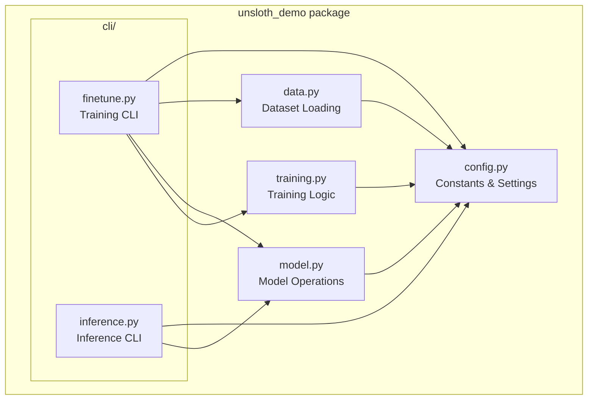
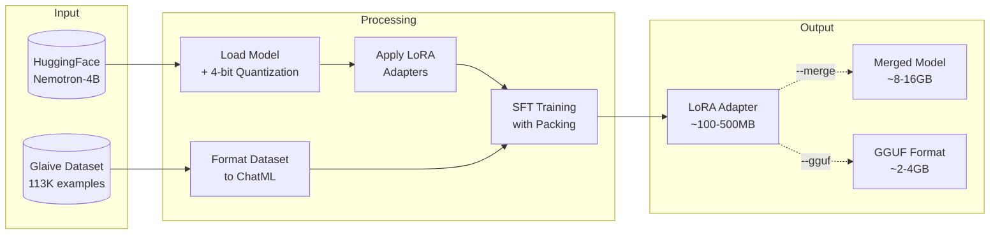
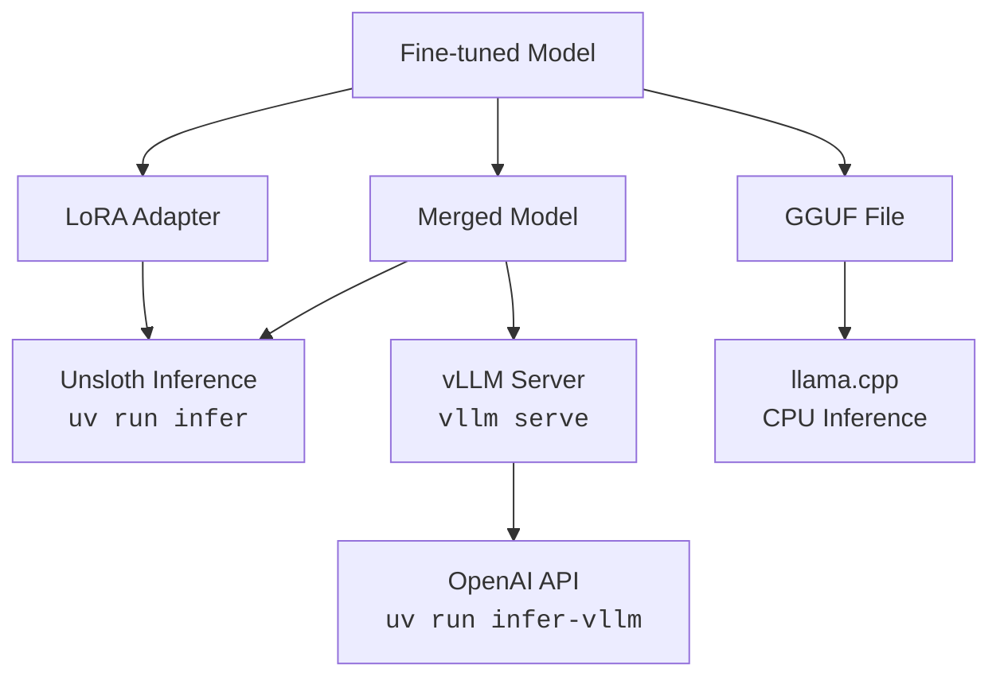
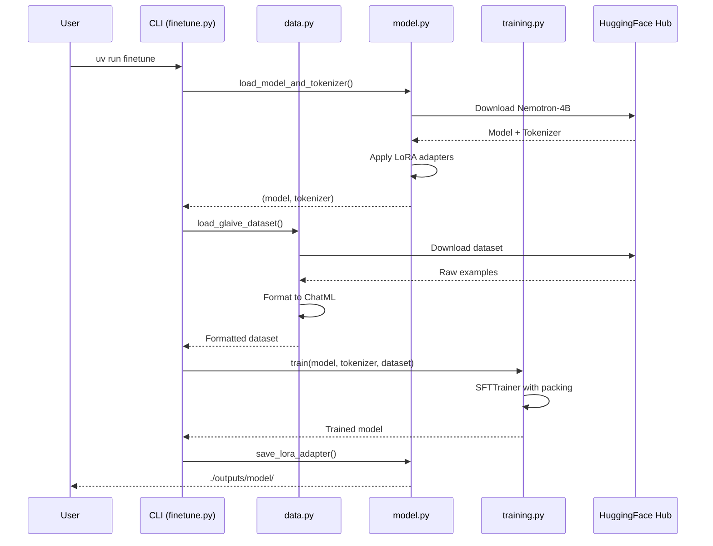

# Architecture

This document provides an overview of the Unsloth Fine-Tuning Demo architecture.

## Package Structure



## Module Responsibilities

| Module                                                   | Purpose                                |
| -------------------------------------------------------- | -------------------------------------- |
| [config.py](../src/unsloth_demo/config.py)               | All constants and configuration values |
| [data.py](../src/unsloth_demo/data.py)                   | Dataset loading and ChatML formatting  |
| [model.py](../src/unsloth_demo/model.py)                 | Model loading, LoRA setup, saving      |
| [training.py](../src/unsloth_demo/training.py)           | SFTTrainer configuration and execution |
| [cli/finetune.py](../src/unsloth_demo/cli/finetune.py)   | Command-line interface for training    |
| [cli/inference.py](../src/unsloth_demo/cli/inference.py) | Command-line interfaces for inference  |

---

## Training Pipeline



### Key Optimizations

1. **4-bit Quantization** - Reduces memory usage by loading model weights in 4-bit precision
2. **LoRA Adapters** - Only trains ~1% of parameters, dramatically reducing memory and compute
3. **Unsloth Kernels** - Custom CUDA kernels for 2x faster training
4. **Gradient Checkpointing** - Trades compute for memory during backward pass
5. **Sequence Packing** - Efficiently packs multiple short sequences into one batch

---

## Inference Options



| Format       | Best For                  | Command                |
| ------------ | ------------------------- | ---------------------- |
| LoRA Adapter | Development, testing      | `uv run infer`         |
| Merged Model | Production, sharing, vLLM | `uv run infer` or vLLM |
| GGUF         | CPU deployment, edge      | llama.cpp              |

---

## Data Flow



---

## Configuration

All configurable values are centralized in [config.py](../src/unsloth_demo/config.py):

```python
# Model
MODEL_NAME = "nvidia/Llama-3.1-Nemotron-Nano-4B-v1.1"
DATASET_NAME = "glaiveai/glaive-function-calling-v2"

# LoRA
LORA_R = 16           # Rank (more = better quality, slower)
LORA_ALPHA = 32       # Scaling factor (usually 2x rank)
MAX_SEQ_LENGTH = 4096 # Context window

# Training
BATCH_SIZE = 2
NUM_EPOCHS = 3
LEARNING_RATE = 2e-4
```

To customize, edit these values before training or create a configuration override system.
