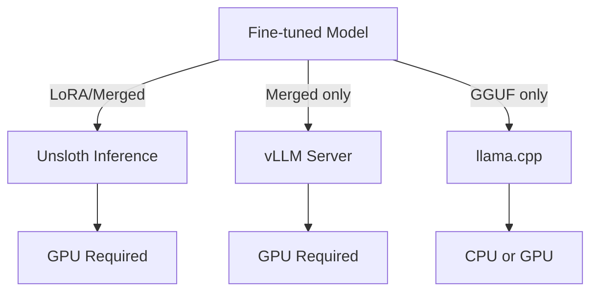
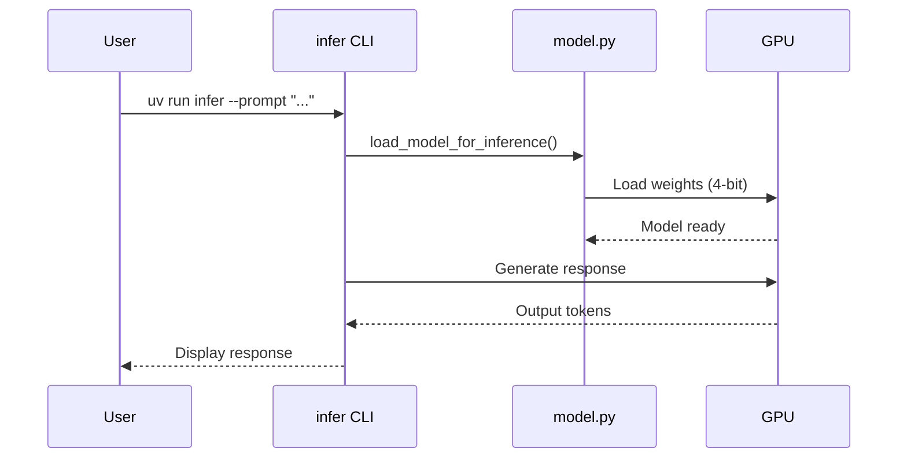
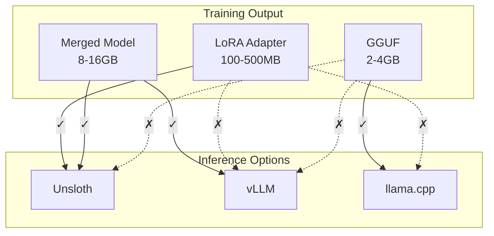

# Inference Guide

This guide covers all methods to run inference with your fine-tuned model.

## Overview

After fine-tuning, you have three ways to run inference:



| Method    | Format      | Speed     | Use Case              |
| --------- | ----------- | --------- | --------------------- |
| Unsloth   | LoRA/Merged | Fast      | Development, testing  |
| vLLM      | Merged      | Very Fast | Production API server |
| llama.cpp | GGUF        | Moderate  | CPU deployment, edge  |

---

## 1. Unsloth Inference

Direct inference using the Unsloth library. Works with both LoRA adapters and merged models.

### Basic Usage

```bash
# Default model path
uv run infer

# Custom model path
uv run infer --model ./outputs/unsloth-nemotron-function-calling

# Custom prompt
uv run infer --prompt "Book a flight to Tokyo for tomorrow"

# All options
uv run infer --help
```

### Options

| Option             | Default                                       | Description            |
| ------------------ | --------------------------------------------- | ---------------------- |
| `--model`          | `./outputs/unsloth-nemotron-function-calling` | Path to model          |
| `--prompt`         | `"What's the weather in Paris?"`              | Input prompt           |
| `--max-tokens`     | 256                                           | Max tokens to generate |
| `--max-seq-length` | 4096                                          | Max sequence length    |

### How It Works



---

## 2. vLLM Server

High-performance inference server with OpenAI-compatible API. **Requires merged model format.**

### Setup

```bash
# Create separate virtual environment (vLLM has different dependencies)
uv venv .venv-vllm --python 3.12
source .venv-vllm/bin/activate

# Install vLLM
uv pip install vllm openai
```

### Start Server

```bash
# Basic server
vllm serve ./outputs/unsloth-nemotron-function-calling-merged \
    --host 0.0.0.0 \
    --port 8000

# With memory limits (for smaller GPUs)
vllm serve ./outputs/unsloth-nemotron-function-calling-merged \
    --host 0.0.0.0 \
    --port 8000 \
    --max-model-len 4096 \
    --gpu-memory-utilization 0.9
```

### Query Server

**Using CLI:**

```bash
source .venv-vllm/bin/activate
uv run infer-vllm
uv run infer-vllm --prompt "Book a flight to Tokyo"
```

**Using curl:**

```bash
curl http://localhost:8000/v1/chat/completions \
    -H "Content-Type: application/json" \
    -d '{
        "model": "./outputs/unsloth-nemotron-function-calling-merged",
        "messages": [{"role": "user", "content": "What is the weather in Paris?"}],
        "max_tokens": 256
    }'
```

**Using Python:**

```python
from openai import OpenAI

client = OpenAI(base_url="http://localhost:8000/v1", api_key="dummy")

response = client.chat.completions.create(
    model="./outputs/unsloth-nemotron-function-calling-merged",
    messages=[{"role": "user", "content": "What's the weather in Paris?"}],
    max_tokens=256
)

print(response.choices[0].message.content)
```

### vLLM Options

| Option         | Default                          | Description            |
| -------------- | -------------------------------- | ---------------------- |
| `--base-url`   | `http://localhost:8000/v1`       | Server URL             |
| `--model`      | `./outputs/...-merged`           | Model path             |
| `--prompt`     | `"What's the weather in Paris?"` | Input prompt           |
| `--max-tokens` | 256                              | Max tokens to generate |

### Troubleshooting vLLM

**Out of Memory:**

```bash
# Reduce context length
vllm serve ./model --max-model-len 2048

# Or increase GPU utilization
vllm serve ./model --gpu-memory-utilization 0.95
```

**Model Not Found:**
Ensure you ran `finetune --merge` to create the merged model.

---

## 3. llama.cpp (GGUF)

Run on CPU without GPU. Perfect for edge deployment.

### Setup

```bash
# Clone and build llama.cpp
git clone https://github.com/ggerganov/llama.cpp
cd llama.cpp
make

# Or with CUDA support
make LLAMA_CUDA=1
```

### Run Inference

```bash
./main -m ../outputs/unsloth-nemotron-function-calling-gguf/model-q4_k_m.gguf \
    -p "What's the weather in Tokyo?" \
    --ctx-size 4096 \
    -n 256
```

### Options

| Option       | Description                           |
| ------------ | ------------------------------------- |
| `-m`         | Model file path                       |
| `-p`         | Prompt text                           |
| `--ctx-size` | Context window size                   |
| `-n`         | Max tokens to generate                |
| `-t`         | Number of threads (CPU)               |
| `-ngl`       | Number of GPU layers (for CUDA build) |

---

## Format Comparison



| Format       | Unsloth | vLLM | llama.cpp |
| ------------ | :-----: | :--: | :-------: |
| LoRA Adapter |   ✅    |  ❌  |    ❌     |
| Merged Model |   ✅    |  ✅  |    ❌     |
| GGUF         |   ❌    |  ❌  |    ✅     |

---

## Performance Tips

### Unsloth

- Use 4-bit loading for memory efficiency
- Works well for development and testing

### vLLM

- Best for production with high throughput
- Supports batching multiple requests
- Use `--tensor-parallel-size` for multi-GPU

### llama.cpp

- Tune thread count (`-t`) for your CPU
- Use `-ngl` to offload layers to GPU if available
- Smaller quantization (q4) = faster but lower quality
