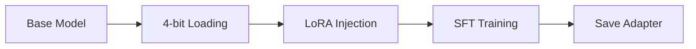
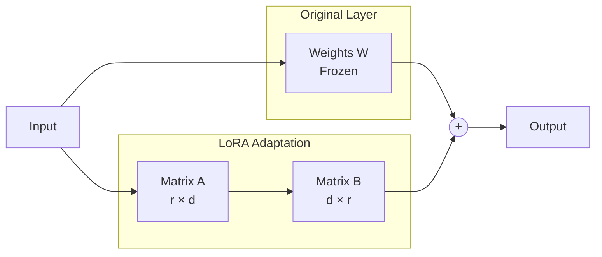
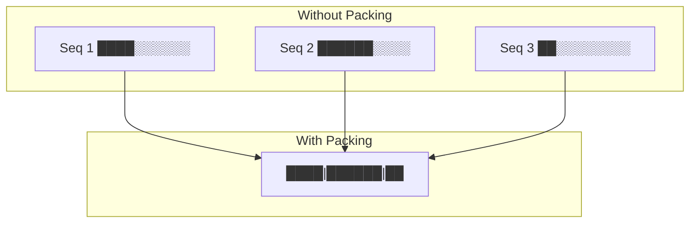

# Training Guide

This guide explains the fine-tuning pipeline in detail.

## Overview

The training pipeline fine-tunes NVIDIA's Nemotron-Nano-4B model on the Glaive Function Calling dataset using LoRA (Low-Rank Adaptation) and Unsloth optimizations.



---

## Quick Start

```bash
# Full training (113K examples, ~3 epochs)
uv run finetune

# Quick test with 1000 samples
uv run finetune --max-samples 1000

# Save all formats
uv run finetune --merge --gguf q4_k_m
```

---

## What is LoRA?

**LoRA (Low-Rank Adaptation)** is a technique that freezes the original model weights and injects small trainable matrices into specific layers.



**Benefits:**

- Train only ~1% of parameters
- Memory efficient (fits on 12GB GPU)
- Can save/load just the adapter (~100MB vs ~8GB)

**Key Parameters:**

- `LORA_R = 16` - Rank of the low-rank matrices (higher = more capacity)
- `LORA_ALPHA = 32` - Scaling factor (usually 2× rank)
- `LORA_DROPOUT = 0.05` - Regularization to prevent overfitting

---

## Target Modules

LoRA is applied to the attention and MLP layers:

| Module      | Function                                |
| ----------- | --------------------------------------- |
| `q_proj`    | Query projection in attention           |
| `k_proj`    | Key projection in attention             |
| `v_proj`    | Value projection in attention           |
| `o_proj`    | Output projection in attention          |
| `gate_proj` | Gating in MLP (for gated architectures) |
| `up_proj`   | Up-projection in MLP                    |
| `down_proj` | Down-projection in MLP                  |

---

## Dataset Format

The Glaive Function Calling dataset contains conversations with function calls:

**Original format:**

```
SYSTEM: You are a helpful assistant with access to functions...
USER: What's the weather in Tokyo?
ASSISTANT: <functioncall> {"name": "get_weather", "arguments": {"city": "Tokyo"}}
FUNCTION RESPONSE: {"temperature": 22, "condition": "sunny"}
ASSISTANT: The weather in Tokyo is sunny with a temperature of 22°C.
```

**Converted to ChatML:**

```
<|im_start|>system
You are a helpful assistant with access to functions...<|im_end|>
<|im_start|>user
What's the weather in Tokyo?<|im_end|>
<|im_start|>assistant
<functioncall> {"name": "get_weather", "arguments": {"city": "Tokyo"}}<|im_end|>
<|im_start|>tool
{"temperature": 22, "condition": "sunny"}<|im_end|>
<|im_start|>assistant
The weather in Tokyo is sunny with a temperature of 22°C.<|im_end|>
```

---

## Training Arguments

| Parameter                     | Value      | Description                           |
| ----------------------------- | ---------- | ------------------------------------- |
| `per_device_train_batch_size` | 2          | Samples per GPU per step              |
| `gradient_accumulation_steps` | 4          | Effective batch = 2 × 4 = 8           |
| `num_train_epochs`            | 3          | Full passes through dataset           |
| `learning_rate`               | 2e-4       | AdamW learning rate                   |
| `warmup_ratio`                | 0.03       | 3% of training for LR warmup          |
| `optim`                       | adamw_8bit | 8-bit optimizer for memory efficiency |

---

## Unsloth Optimizations

Unsloth provides several optimizations that make training faster and more memory-efficient:

### 1. Custom CUDA Kernels

Fused operations that reduce memory transfers between GPU memory and registers.

### 2. Gradient Checkpointing

```python
use_gradient_checkpointing="unsloth"
```

Instead of storing all activations, recompute them during backward pass. Trades compute for memory.

### 3. Sequence Packing

```python
packing=True
```

Multiple short sequences are packed into a single batch element, reducing padding waste.



---

## Memory Requirements

| GPU         | VRAM | Batch Size | Notes                         |
| ----------- | ---- | ---------- | ----------------------------- |
| RTX 3060    | 12GB | 1          | Works with reduced seq length |
| RTX 4070 Ti | 12GB | 1-2        | Recommended minimum           |
| RTX 4080    | 16GB | 2          | Comfortable                   |
| RTX 4090    | 24GB | 4          | Fast training                 |

### If You Run Out of Memory

1. **Reduce batch size** in [config.py](../src/unsloth_demo/config.py):

    ```python
    BATCH_SIZE = 1
    ```

2. **Reduce sequence length**:

    ```python
    MAX_SEQ_LENGTH = 2048  # or 1024
    ```

3. **Increase gradient accumulation** (maintains effective batch size):
    ```python
    GRADIENT_ACCUMULATION_STEPS = 8
    ```

---

## Output Formats

### LoRA Adapter (Default)

```bash
uv run finetune
```

- **Size:** ~100-500MB
- **Use case:** Development, experimentation
- **Loading:** Requires base model + adapter

### Merged Model

```bash
uv run finetune --merge
```

- **Size:** ~8-16GB
- **Use case:** Sharing, production, vLLM
- **Loading:** Standalone, no base model needed

### GGUF

```bash
uv run finetune --gguf q4_k_m
```

- **Size:** ~2-4GB (varies by quantization)
- **Use case:** CPU inference, edge deployment
- **Loading:** llama.cpp or compatible tools

| Quantization | Size    | Quality    |
| ------------ | ------- | ---------- |
| `f16`        | Largest | Best       |
| `q8_0`       | Large   | Very Good  |
| `q5_k_m`     | Medium  | Good       |
| `q4_k_m`     | Small   | Acceptable |

---

## Monitoring Training

Training logs are printed to console every `LOGGING_STEPS` (default: 10):

```
{'loss': 1.234, 'learning_rate': 0.0002, 'epoch': 0.5}
{'loss': 0.987, 'learning_rate': 0.00019, 'epoch': 1.0}
...
```

### Enable Weights & Biases

Edit [training.py](../src/unsloth_demo/training.py):

```python
report_to="wandb",  # Instead of "none"
```

Then run:

```bash
wandb login
uv run finetune
```
